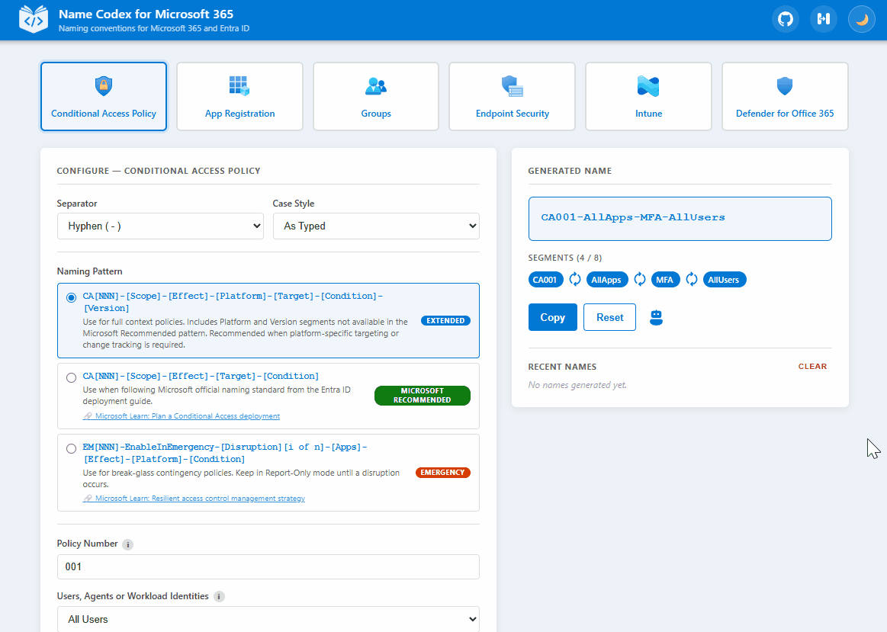

# Name Codex for Microsoft 365

A free naming convention generator for Microsoft 365 and Entra ID objects.

## Overview

Name Codex is a free, single-file, client-side naming convention generator built for Microsoft 365 and Entra ID objects, including App Registrations, Conditional Access Policies, Groups, Defender for Office 365 policies, Endpoint Security profiles, and Intune policies. It's built from real IT consulting experience helping organizations bring order to their tenants, and it's meant as flexible inspiration rather than a rigid standard. Pick an object type, pick a pattern, fill in a few fields, and copy out a consistent, readable name.

## Demo

Try it out at [namecodex.app](https://namecodex.app).

## Tech Stack

- Single-file HTML, CSS, and JavaScript, no framework
- No build step, no dependencies
- `localStorage` for persisting theme preference and recent name history
- Hosted on Azure Static Web Apps, deployed via GitHub Actions

## Contributing

Naming conventions are opinionated by nature, and the patterns in Name Codex reflect real-world consulting experience, but they won't fit every environment. If you have feedback on an existing pattern, a variation you use in production, or a naming convention for an object type that isn't covered yet, please open a GitHub issue. This project grows through community feedback, so practical suggestions from IT admins and consultants are the most valuable input it can get.

## Credits

Built by [Matej](https://www.matej.guru).
