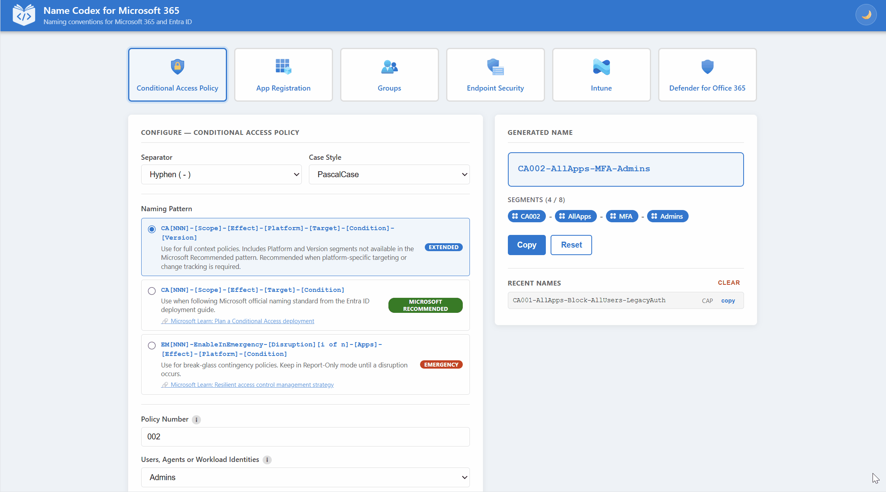

# Name Codex for Microsoft 365

A free naming convention generator for Microsoft 365 and Entra ID objects.

## Overview

Name Codex is a free, single-file, client-side naming convention generator built for Microsoft 365 and Entra ID objects, including App Registrations, Conditional Access Policies, Groups, Defender for Office 365 policies, Endpoint Security profiles, and Intune policies. It's built from real IT consulting experience helping organizations bring order to their tenants, and it's meant as flexible inspiration rather than a rigid standard. Pick an object type, pick a pattern, fill in a few fields, and copy out a consistent, readable name.

## Demo

<!-- TODO: replace docs/demo.gif with an actual screen recording of the app in use -->


## Features

Name Codex covers six object types, each with its own set of naming patterns.

### Conditional Access Policy

- `CA[NNN]-[Scope]-[Effect]-[Platform]-[Target]-[Condition]-[Version]` (Extended): full context policies, including platform and version segments for platform-specific targeting or change tracking.
- `CA[NNN]-[Scope]-[Effect]-[Target]-[Condition]` (Microsoft Recommended): follows the official naming standard from the Entra ID deployment guide.
- `EM[NNN]-EnableInEmergency-[Disruption][i of n]-[Apps]-[Effect]-[Platform]-[Condition]` (Emergency): break-glass contingency policies, kept in Report-Only mode until a disruption occurs.

### App Registration

- `[Tool]-[Function]-[AccessLevel]-[Env]-[Version]` (Generic): best for single-tenant organisations, focused on what the app does, its access level, and its deployment environment.
- `[Company]-[Dept]-[Tool]-[Function]-[AccessLevel]-[Env]-[Version]` (Enterprise): best for large organisations with department-level segregation.
- `[Tool]-[Customer]-[AccessLevel]-[Env]-[Version]` (MSP): best for MSPs managing multiple customer tenants, with the tool listed first for quick filtering by product.
- `[Project]-[Tool]-[AccessLevel]-[Env]-[Version]` (Project): best for time-bound integrations, where the project name identifies the context instead of the company.

### Groups

- `[Prefix]-[MembershipType]-[Department]-[Function]-[Scope]-[Environment]` (Security): general-purpose security group for access control, policy assignment, or resource scoping.
- `[Prefix]-[MembershipType]-[Department]-[Purpose]-[Sensitivity]-[Environment]` (M365 Group): Microsoft 365 Group with a shared mailbox, calendar, and collaboration space across Microsoft 365 services.
- `[Prefix]-[Scope]-[Department]-[Purpose]-[Environment]` (Distribution): distribution list for sending email to a defined set of recipients.
- `[Prefix]-[Department]-[Function]-[Location]-[Environment]` (Shared Mailbox): shared mailbox accessible by multiple users for monitoring and sending from a common email address.
- `[Room/Equip]-[Department]-[Location]-[Name]` (Room / Equip): resource mailbox for bookable rooms or equipment, integrated with Outlook calendar scheduling.
- `[Prefix]-[Role/Resource]-[Scope]-[AccessType]-[Environment]` (PIM): Privileged Identity Management group for just-in-time access to privileged roles and resources.

### Endpoint Security

- `[NNN]-[ScopeTag]-Windows-[ProfileType]-[Assignments]-[Descriptor]-[Environment]-[Version]` (Windows): endpoint security policies for Windows devices, covering antivirus, firewall, attack surface reduction, and endpoint detection and response.
- `[NNN]-[ScopeTag]-macOS-[ProfileType]-[Assignments]-[Descriptor]-[Environment]-[Version]` (macOS): endpoint security policies for macOS devices, covering antivirus and endpoint detection and response.
- `[NNN]-[ScopeTag]-Linux-[ProfileType]-[Assignments]-[Descriptor]-[Environment]-[Version]` (Linux): endpoint security policies for Linux devices, covering antivirus, endpoint detection and response, and global exclusions.

### Intune

- `[NNN]-[ScopeTag]-[OSType]-Compliance-[Assignments]-[Descriptor]-[Environment]-[Version]` (Compliance Policy): device compliance policy that evaluates whether a device meets your organization's security requirements.
- `[NNN]-[ScopeTag]-[OSType]-[Assignments]-[Descriptor]-[Environment]-[Version]` (Configuration Policy): configuration profile that pushes settings to enrolled devices, such as Wi-Fi, VPN, email, or endpoint protection, and can also cover Intune scripts and remediation scripts.
- `[NNN]-[ScopeTag]-[Platform]-AppProtection-[Assignments]-[Descriptor]-[Environment]-[Version]` (App Protection): protects organizational data within managed apps, independent of device enrollment.
- `[NNN]-[ScopeTag]-[EnrollmentType]-AppConfig-[Target]-[Descriptor]-[Environment]-[Version]` (App Configuration): pre-configures settings inside a managed app for enrolled devices or managed apps.

### Defender for Office 365

- `[Prefix]-[AntiPhish]-[ScopeType]-[Descriptor]-[Environment]-[Version]` (Anti-Phishing): protects against impersonation, spoofing, and phishing attacks targeting your recipients.
- `[Prefix]-[AntiSpam]-[Direction]-[ScopeType]-[Descriptor]-[Environment]-[Version]` (Anti-Spam): filters unwanted bulk and spam email, the only policy type with separate inbound and outbound protection.
- `[Prefix]-[AntiMalware]-[ScopeType]-[Descriptor]-[Environment]-[Version]` (Anti-Malware): scans inbound email attachments for known malware signatures.
- `[Prefix]-[SafeAttachment]-[ScopeType]-[Descriptor]-[Environment]-[Version]` (Safe Attachments): detonates email attachments in a sandbox to detect zero-day malware before delivery, requires Defender for Office 365.
- `[Prefix]-[SafeLinks]-[ScopeType]-[Descriptor]-[Environment]-[Version]` (Safe Links): scans and rewrites URLs in email and supported apps to protect against malicious links at time of click, requires Defender for Office 365.
- `[Prefix]-[AccessLevel]-[Notify]` (Quarantine): defines what end users can do with their quarantined messages and whether they receive notifications, referenced by other policy types for specific verdicts.

## Live Demo

Try it out at [namecodex.app](https://namecodex.app).

## Tech Stack

- Single-file HTML, CSS, and JavaScript, no framework
- No build step, no dependencies
- `localStorage` for persisting theme preference and recent name history
- Hosted on Azure Static Web Apps, deployed via GitHub Actions

## Getting Started / Local Development

There's nothing to install and nothing to build. Clone the repository and open `index.html` directly in your browser:

```bash
git clone https://github.com/<your-org>/name-codex.git
cd name-codex
start index.html   # or just double-click the file
```

Since the app is a single static file, any change can be tested immediately by refreshing the page, no dev server required.

## Contributing

Naming conventions are opinionated by nature, and the patterns in Name Codex reflect real-world consulting experience, but they won't fit every environment. If you have feedback on an existing pattern, a variation you use in production, or a naming convention for an object type that isn't covered yet, please open a GitHub issue. This project grows through community feedback, so practical suggestions from IT admins and consultants are the most valuable input it can get.

## Credits

Built by [Matej](https://www.matej.guru).
